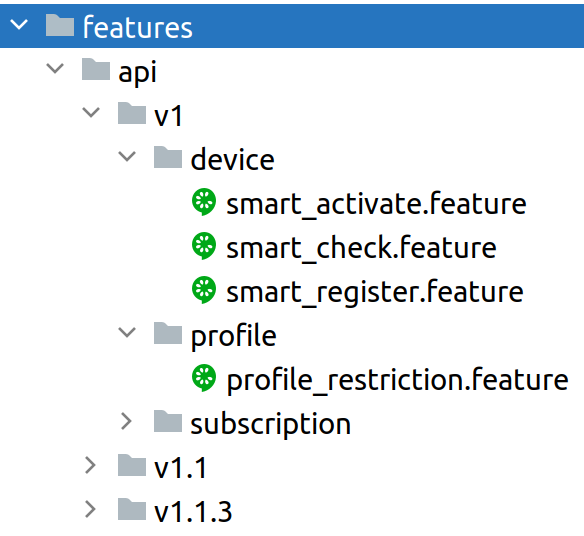
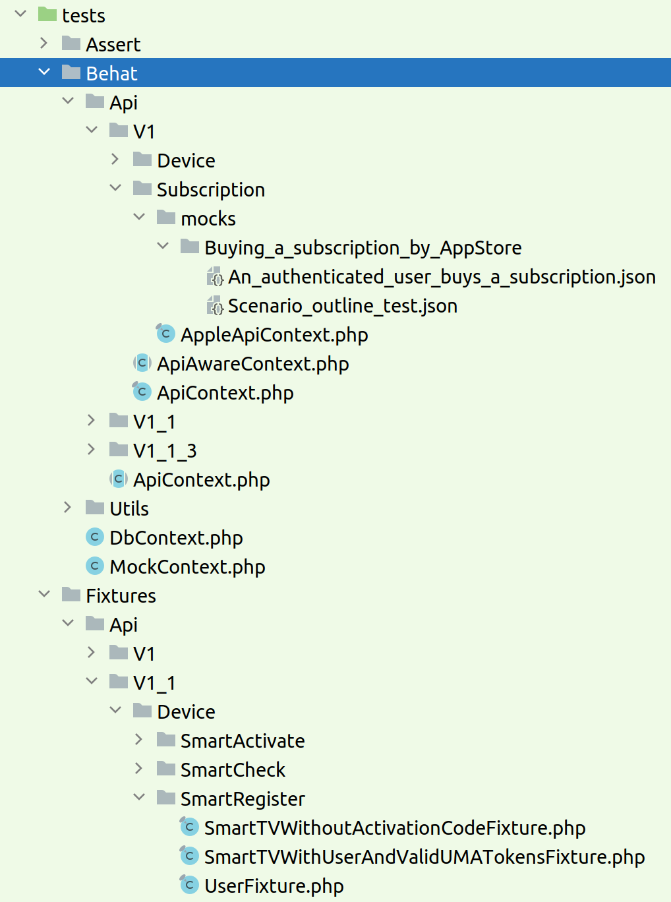

# Функциональное тестирование с помощью Behat
## Установка
Если wiremock не запущен, выполнить команду `make up_local`.

## Запуск
Выполнить `make behat`.

## Структура тестов

### Конфигурация, структура файлов и директорий

Тесты описываются в feature-файлах, которые хранятся в директории features в корне проекта.

Все фичи разделены по типам (api, command и т.д.) и по функциональности (subscription, profile и т.д.)



При добавлении нового набора фич нужно добавить его в файл behat.yml.

```yaml
default:
    suites:
        
        # ... описание ранее добавленных наборов
        
        # описание нового набора
        Api/V1/Subscription:
            contexts:
                - App\Tests\Behat\Api\V1\ApiContext
                - App\Tests\Behat\Api\V1\Subscription\AppleApiContext
            paths: [ '%paths.base%/features/api/v1/subscription' ]
```

В этом примере добавлен набор фич с именем `Api/V1/Subscription`.

В `contexts` должны явным образом указываться все необходимые для набора тестов контексты.

В `paths` указываются директории, из которых будут считываться feature-файлы и выполняться с указанными контекстами. 

Файлы с дополнительными контекстами для этого набора должны находиться в `tests/Behat/Api/V1/Subscription`.

Файлы моков для этого набора должны находиться в директории `tests/Behat/Api/V1/Subscription/mocks`.

Структура файлов выглядит следующим образом:



### Моки

При тестировании вызовы к внешним сервисам подменяются на вызовы к wiremock.
Для этого создаются файлы с моками для сценариев, у которых ожидаются внешние вызовы.
Каждый набор тестов имеет свою директорию для моков `tests/Behat/<SuiteName>/mocks`.
Если для сценария файл с моками существует, содержимое файла автоматически загружается в wiremock.
В Behat существует два вида сценариев: `Scenario` и `Scenario Outline`.
Работа с этими типами немного отличается, поэтому отличается и алгоритм автозагрузки моков.

#### Обычный сценарий (Scenario)

Алгоритм определения, существует ли файл с моками для сценария следующий:

1. Из названия фичи берётся подстрока до первой точки, если точки в названии фичи нет - берётся всё название полностью.
2. В получившейся подстроке пробелы заменяются на знак подчеркивания `_`, при этом несколько идущих подряд пробелов считаются за один. 
   Получившийся результат - это имя директории, в которой будет происходить дальнейший поиск файла с моками.
3. Из названия сценария берётся подстрока до первой точки, если точки в названии сценария нет - берётся всё название полностью. 
4. В получившейся подстроке производится замена пробелов тем же образом, как при обработке имени фичи. 
   Получившийся результат + постфикс `.json` составляют имя файла с моками.
5. Если файл по вычисленному пути существует, он загружается в wiremock.
   Если файл не найден - считается, что моки для сценария не определены.

```gherkin
# SuiteName: Api/V1/Subscription (определено в behat.yml)
    
Feature: Buying a subscription by AppStore
    In order to buy subscriptions by AppStore
    As an user
    I need to be able request Apple purchase API

    Scenario: An authenticated user buys a subscription. Expanded scenario description
        Given I am an authenticated user
        When I make a valid apple purchase request /app/v1/oc/apple/purchase
        Then I should see response code 200
        And I should see response json
        """
        {
            "code": 200,
            "msg": "Успех"
        }
        """
```

При поиске файла моков для этого сценария имена будут следущими:

- Имя директории: `Buying_a_subscription_by_AppStore`
- Имя файла с моками: `An_authenticated_user_buys_a_subscription.json`
- Имя файла от корня проекта: `tests/Behat/Api/V1/Subscription/mocks/Buying_a_subscription_by_AppStore/An_authenticated_user_buys_a_subscription.json`

Содержимое файла с моками представляет собой json-массив с объектами моков, например

```json
[
    {
        "uri": "/v2/apple/purchase",
        "method": "POST",
        "request_body": {
            "subscriberId": "12345678901",
            "receipt": "",
            "productId": "1",
            "programId": "",
            "idempotenceKey": "1",
            "client": "SAMSUNG_TIZEN"
        },
        "response_content_type": "application/json",
        "response_body": {
            "code": 200,
            "msg": "Успех"
        }
    }
]
```

#### Шаблонный сценарий (Scenario Outline)

При выполнении шаблонный сценарий разворачивается в набор сценариев, в которые подставляются значения из `Examples`.
При этом названием сценария является строка из `Examples`, по которой этот сценарий был сгенерирован.

Алгоритм определения, существуют ли моки для сценария, сгенерированного из шаблона, следующий:

1. Из названия фичи берётся подстрока до первой точки, если точки в названии фичи нет - берётся всё название полностью.
2. В получившейся подстроке пробелы заменяются на знак подчеркивания `_`, при этом несколько идущих подряд пробелов считаются за один.
   Получившийся результат - это имя директории, в которой будет происходить дальнейший поиск файла с моками.
3. Из названия шаблона берётся подстрока до первой точки, если точки в названии шаблона нет - берётся всё название полностью.
4. В получившейся подстроке производится замена пробелов тем же образом, как при обработке имени фичи.
   Получившийся результат + постфикс `.json` составляют имя файла с моками.
5. Выбирается значение из первого столбца example-строки, по которой был сгенерирован текущий сценарий.   
Это значение - ключ, по которому в файле моков будет идти поиск нужного набора моков.
6. Если файл по вычисленному пути существует и в нём есть блок данных по ключу - этот блок загружается в wiremock.
   Если файл не найден или в файле нет нужного ключа - считается, что моки для сценария не определены.

```gherkin
# SuiteName: Api/V1/Subscription (определено в behat.yml)

Feature: Buying a subscription by AppStore
    In order to buy subscriptions by AppStore
    As an user
    I need to be able request Apple purchase API

    Scenario Outline: Scenario outline test
        Given I am an authenticated user
        When I make a valid apple purchase request /app/v1/oc/apple/purchase
        Then I should see response code <code>
        And I should see response json
        """
        {
            "code": <code>,
            "msg": <msg>
        }
        """

        Examples:
            | code | msg               |
            |  200 | "Успех"           |
            |  201 | "Не совсем успех" |
```

При поиске моков для сценария, сгенерированного по первой строке `Examples`, имена будут следущими:

- Имя директории: `Buying_a_subscription_by_AppStore`
- Имя файла с моками: `Scenario_outline_test.json`
- Имя файла от корня проекта: `tests/Behat/Api/V1/Subscription/mocks/Buying_a_subscription_by_AppStore/Scenario_outline_test.json`
- Ключ с нужным блоком данных: `200`

Содержимое файла с моками представляет собой json-объект, в котором по ключу находятся json-массивы с объектами моков, например

```json
{
    "200": [
        {
            "uri": "/v2/apple/purchase",
            "method": "POST",
            "request_body": {
                "subscriberId": "12345678901",
                "receipt": "",
                "productId": "1",
                "programId": "",
                "idempotenceKey": "1",
                "client": "SAMSUNG_TIZEN"
            },
            "response_content_type": "application/json",
            "response_body": {
                "code": 200,
                "msg": "Успех"
            }
        }
    ]
}
```

### Фикстуры

Для большинства сценариев требуется наличие определённых данных в базе данных.
Для загрузки этих данных в базу используются фикстуры.

Принятые договорённости:

1. Каждый feature-файл должен использовать свой полностью независимый набор фикстур
2. Файлы фикстур хранятся в директории `tests/Fixtures/<SuiteName>/<FeatureFixturesDirName>`.
   Имя `FeatureFixturesDirName` не имеет строгих требований, но должно однозначно указывать, какой фиче этот набор фиктур принадлежит.
